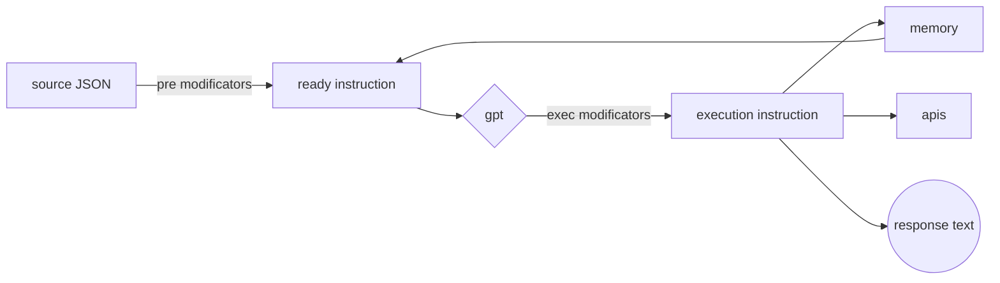

### Добро пожаловать в документации о написании исполняемых инструкций AI-M
## Общие положения


Исполняемая инструкция предстовляет из себя JSON где каждое поле будет описано ниже. Также  могут содержать модификаторы выполняемые в разные этапы жизненого цикла инструкции.

Каждая инструкция вызывает ряд исполняемых скриптов, которые могут выполнять полезную работу а так же изменять саму инструкцию, среди которых есть скрипт использующий gpt4, конечный вид инструкции содержит результирующий текст и параметры для конечных исполняемых скриптов, выполняющих полезную работу. 

#### JSON keys
```
   {
         "trigger": Keyword/unique name of the instruction,
         "welcome": text of the resulting message upon first request,
         "delay": number of seconds - minimum pause after a welcome message,
         "prompt": {
             "answer": basic guidance on what the resulting answers should be,
             "memory": basic guidance on what information is remembered,
             "apis": "json array of methods available for execution based on response results"
         },
         "recovery": {
             "wait": number of seconds from the first message when you need to come back and remind yourself,
             "text": reminder text
         },
     }
```
#### Life cycle and modificators


> pre modificators works only por "prompt"

##  Prompt
### answer
В этом поле описываются общие инструкции о том, что именно отвечать клиенту, оно также может быть изменено `pre modificators`, а также учитывайте, что в момент ее исполнения доступна информация о времени и `memory`

1. Определите конечную цель инструкции: перед тем, как начать писать инструкцию, определите, какую цель она должна достигнуть. Например, целью может быть описание шагов для выполнения определенной задачи или обучение сотрудников по использованию определенного программного обеспечения. 
2. Идентифицируйте ЦА ваших инструкций: вы должны знать, кто будет использовать ваши инструкции, чтобы соответствующим образом определить стиль и уровень детализации написания. Учтите уровень знаний и навыков ЦА при написании. 
3. Структурируйте текст инструкции: разделите инструкцию на понятные шаги или этапы, расположите их в логическом порядке. Используйте нумерацию или маркировку для облегчения восприятия. 
4.  Используйте простой и понятный язык: избегайте использования сложных терминов, специфической терминологии и длинных предложений. Пишите кратко, ясно и понятно. 
5.  **Ошибки** - обязательно опишите исчерпывающий порядок действий для нежелательных или непредвиденных ситуаций. 
6. Проверьте инструкцию на понимание: после написания инструкции, пройдите по ней самостоятельно, чтобы проверить, понятны ли вам все шаги и инструкции. Если что-то не понятно или необходимо внести изменения, исправьте соответствующим образом.

### memory
Это поле описывает что необходимо запомнить. Учитывайте, что запомненная информация доступна между сессиями, не сохроняйте туда конфеденциальную информацию.  Оно также может быть изменено `pre modificators`, а также учитывайте, что доступна информация о времени и предыдущем `memory`.

>Во избежании переполнения реализован механизм **забывания**, учитывайте это.
>Время забывания определяется автоматически, однако вы можете дополнить информацию об этом.

>Пожалуйста используйте `условия`, во избежании повторного запоминания фактов

>Учитывайте что общий обьем памяти составляет около 800 токенов, 
>переполнение памяти может привести к **фатальной ошибке**

*Если бы вы помнили каждое мгновение с момента вашего рождения вы бы сошли с ума, а после и вовсе ваша нервеная система дала бы сбой, поэтому **забывание** - критически важный механизм, относитесь к себе и к программам бережно*

### apis
В этом поле необходимо указать какие `http/https` медоды необходимо выполнить. Оно также может быть изменено `pre modificators`, а также учитывайте, что доступна информация о времени и `memory`

В качестве результата укажите массив JSON:
```
'[
	"http://localhost:8000/test?name=userName", 
	{
		"url":"http://localhost:8000/test?name=userName", 
		"method": "POST", 
		"headers": {"content-type": "application/json"}, 
		"body": {"phone": "userPhone" 
	} 
]'
```

## Modificators
### pre modificators
Модификаторы выполняющую полезную нагрузку и изменяющие инструкцию до обработки `gpt`

1. Модификаторы подстановки 
- **`[[metadata-key]]`**
-  **`[[/EcmaScript-Regex/]]`**

2. Модификаторы для вызова http 
- **`<<GETjson<https://adress.com>>>`**
- **`<<GETtext<https://adress.com>>>`**
- **`<<GEThtml<https://adress.com>>>`**


>**Regex**  поиск совпадения в истории сообщений (может быть разное колличество в зависимости от клиента, например: telegramBot: до 7, plagin: сколько загруженно на странице и так далее)

>**metadata** обьект может содержать разные ключи в зависимости от клиентского приложения например:
```
	//telegramBot
	{
		clientName:  msg.from.username, 
		clientId:  msg.from.id, 
		webClient:  'telegram'
	}
	//plagin-instagram
	{
		clientName:  dialog-name, 
		clientId:  null, 
		webClient:  'instagram.com'
	}
```
### exec modificators
Модификаторы выполняющую полезную нагрузку после обработки `gpt`
 
 - **`{{key}}`**
 > Эти ключи не явлются частью строгого пространства имен, они должны отражать смысловую нагрузку о том что необходимо подставить вместо них

### Порядок выполнения модификаторов

> Модификаторы выполняются в порядке упоминания в этой интсрукции


## Exemples
Давайте создадим асистента вместе и рассмотрим разные кейсы использования.
> Мы будем сосдавать `асистента продавца` для автоворонок блогера-эксперта, однако нам бы не хотелось что бы этот пример ограничивал вашу фантазию на приедмет использования этого инструмента, поэтому в конце мы коротко перечислим кейсы которые удалось создать нашей команде.

- Предположим наш эксперт продает консультации для самозанятых и обещает после занятий что клиент научиться освобождать свое время не теряя в доходе. 	
- У эксперта есть "лид-магнит" - бесплатный чек лист по которому самозанятый сможет найти свои ошибки
- Эксперт дает рекламу предлогая бесплатный чеклист, для этого необходимо написать в личные сообщения например в инстаграм.
- Предположим эксперт ведет свою работу в google-sheets, умеет создавать опросы и открывать доступ к документам по ссылке. (В вашем случае это может быть CRM система, ваше приложение или вовсе ничего из этого)
- **Цель** `асистента продавца` **отправить** обещанный чеклист, а так же **собрать информацию** о клиенте и **назначить онлайн встречу**

### шаг 1 

	{	    
		"trigger": "Time",
	    "welcome": "Привет, спасибо что написал мне, буду рад познакомиться, а пока что вот твой чек-лист https://link-to-check-list",
	    "delay": 18000,
	    
	    ...
	}

Таким образом, если кто то напишет эксперту в личные сообщения `Time`, то он станет клиентом и получит в ответ - `Привет, спасибо что написал мне, буду рад познакомиться, а пока что вот твой чек-лист https://link-to-check-list`

> Если используется профиль чат-бота, то отправлять тригер-слово не обязательно

После клиент получит следущее сообщение только через 18000 секунд или 5 часов. 
***Обратите внимание**, что он получит следующее сообщение через 5 часов даже в том случае если он сам написал первым и диалог уже начался, поэтому рекомендуется выбирать `delay` либо очень маленьким, либо наоборот значительным.*

### шаг 2
	 {
	 ...
	 "prompt": {
	        "answer": "Отвечай от имени Сергея. ПРИТВОРИСЬ СЕРГЕЕМ!
			Вот какая у Сергея манера писать:
			--------
			Как вы знаете, я давно занимаюсь предпринимательством. Сейчас я сфокусирован на направлении консалтинг или наставничество. 
			Я помогаю экспертам и предпринимателям, которые развиваются в онлайне, продают свои курсы, консультации, продукты. 
			Я бы хотел, чтобы вы дали мне обратную связь по моей трехмесячной программе "Формула Счастливого Времени", 
			в которую я заложил все свои знания и опыт по маркетингу, продажам, делегированию и построению бизнеса в онлайне. 
			Она нацелена на то, чтобы эксперты, то есть ВЫ, могли монетизировать кучу своих знаний регулярно, работая не больше 3 часов в день. 
			Я дам вам чек-лист, что бы вы самостоятельно смогли определить свои проблемные зоны
			Только для тех, кто уже умный и богатый (экспертный, компетентный, постоянно обучается, развивается), но еще не свободный.
			Потому что для того, чтобы на своих знаниях и опыте еще и зарабатывать много и масштабно, то нужно просто знать 
			правильную комбинацию действий или финансовую модель. Просто продавать консультацию, курс, интенсив, марафон - это к успеху не приводит, как не старайся...
			------------

			ЗАДАЧА ЗАПИСАТЬ СОБЕСЕДНИКА НА ЛИЧНУЮ ОНЛАЙН КОНСУЛЬТАЦИЮ (созвон)
			1 Нужно узнать в какой сфере собеседник эксперт.
			2 Узнать как много (свободного) занимается хобби или путешествует.
			3 Узнать как много (свободного)времени собеседник проводит с семьей.
			4 Нужно договориться о времени.

			Запись СТРОГО понедельник-пятница с 12:00 до 17:00 ЕСЛИ на это время НЕ ЗАПИСАН ДРУГОЙ.
			Встреча занимает 45 минут и на встрече может быть только один человек.

			Будь настойчивым договариваясь о встрече, обьясняй зачем это нужно и почему это 
			важно, всегда будь вежлив и радостен. От этого много зависит!


			КРИТИЧЕСКИ ВАЖНО ОТВЕЧАТЬ КОРОТКО в 1-2 предложения НА ИСПАНСКОМ И НЕ ПОВТОРЯТЬСЯ!

			Когда договориться удалось напиши: 
			-----------
			Отлично, тогда встретимся 2023-07-12 13:00, здесь: 
			https://meet.google.com/fhn-rhie-njy
			-----------
			На вопрос Когда у меня встреча отвечай: 2023-07-12 13:00
	
			В ЛЮБЫХ НЕПОНЯТНЫХ СИТУАЦИЯХ И НЕПРЕДВИДЕННЫХ СЛУАЯХ уточни тебе ли 
			адресованно сообщение и если да - сообщи что ты занимаешься консалтингом или
			наставничеством и готов помочь только в этом.

			",
			...
		}
		...
	}

Внимательно ознакомьтесь с примером.
Для начала давайте исправим `Отлично, тогда встретимся 2023-07-12 13:00`, ведь в действительности мы хотим предложить запись в разное время. 

	{
		...
		Отлично, тогда встретимся {{MeetingDateTime}}...
		...
	}

> Здесь мы меняем текс для клиента (то есть только после обработки gpt)
> с помощью `exec modificator` **`{{MeetingDateTime}}`**

Теперь давайте посмотрим как исправить `На вопрос Когда у меня встреча отвечай: 2023-07-12 13:00`
1. По графику созвонов из гугл таблиц (как создать рассмотрим позже) 

```
{
	...
	На вопрос "Когда у меня встреча" учитывай имя клиента - [[clientName]] и график созвонов:
	-----
	<<GEThtml<https://docs.google.com/spreadsheets/sheetID>>>
	-----
	...
}
```

> Здесь мы воспользовались `pre modificator` **`[[clientName]]`**,  который вставит имя клиента,   
> а также  `pre modificator`  **`<<GEThtml<https://adress.com>>>`** для получения графика созвонов

2. Из CRM системы, вашего приложения и так далее
```
{
	...
	На вопрос "Когда у меня встреча" учитывай: 
	<<GETjson<https://crm-adress.com/client?id=[[clientName]]>>>
	...
}
```

> В этом случае сначала сработает замена `[[clientName]]` сформировав
> `<<GETjson<https://crm-adress.com/client?id=Jhon%20Doe>>>`, а после
> эта строка замениться результатом выполннения запроса

3. Если Асистент запоминает записи, расмотрим это позже

### примечание   
http модификаторы
- **`<<GETjson<https://adress.com>>>`**
- **`<<GETtext<https://adress.com>>>`**
- **`<<GEThtml<https://adress.com>>>`**  
- 
Можно использовать не только для получения информации со страниц и дак далее, но и для выполнения  полезной работы  `<<GETjson<https://adress.com?payloadPhone=[[/PhoneNumberRegex/]]>>>` однако учитывайте что этот запрос будет выполняться каждое сообщение, а если телефон в диалоге отсутствует, то `null`

### шаг 3
```
{
	...
	"prompt": {
		...
		 "memory": "Когда договориться удалось : 
			 'Встреча {{MeetingDateTime}} - [[clientName]]'",
		...
	}
	...
}
```

> Здесь мы запоминаем о том кто записан для того, что бы избежать 
>  повторной записи в одно и тоже время, при этом если имя клиента упоминалось в инструкции 
>  раньше, то  **`[[clientName]]`** можно заменить на **`{{СlientName}}`**

> **Помните** длинна инструкции влияет на колличество токенов используемых каждое сообщение,
>  а переполнение памяти может вывести асистента из строя.

### шаг 4
```
{
	...
	"prompt": {
		"apis": "Когда договориться удалось:  '[{\"url\":\"https://docs.google.com/forms/u/0/d/e/formID/formResponse\", \"method\": \"POST\", \"headers\": {\"content-type\": \"application/x-www-form-urlencoded\"}, \"body\": \"entry.2100238404={{MeetingDateTime}}&entry.1956306343={{expertArea}}\" } ]'"
	}
	...
}
```

> Когда удасться договориться о встрече отправим гугл форму со временем
> встречи, что бы эксперт знал когда у него "созвоны".  Также можно
> вызывать несколько запросов, например отправляя даные в CRM или делая
> другие запросы.

### шаг 5

```
{
...
"recovery": {
        "wait": 173000,
        "text": "Привет, Какие успехи"
    }
...
}
```

> Если вы хотите возобновить диалог

## Алея идей
Нам бы не хотелось, что бы этот пример ограничивал вашу фантазию на приедмет использования этого инструмента, поэтому мы коротко перечислим кейсы которые удалось создать нашей команде.

- Самое очевидное, Ассистент который сначала отдает лид-магнит (закрытое видео автора), потом продает инфо-программу + ведение ментора, через 2 месяца ассистент возвращался с вопросом о том купил ли лид программу, на сколько она понравилась и мягко закрывает либо на продажу програмы либо (если програма пройдена и все понравилось) вип-консультацию с основателем.

- Date planer. Один из наших сотрудников в этапе ухаживаний, поэтому на этапе тестирования, он сделал ассистента который смотрит афишу,  погоду, а так же рестораны поблизости к месту события и выдает 2-4 варианта как может пройти выходной. Теперь он всегда на готове и просто не отрозим.
- Меннеджер аккаунтов. Хотя мы настаивали на том, что еще слишком рано, был создан ассистент, который получал данные с биржи, первую страницу новостных изданий и выдавал предположение о том куда двинется рынок. И второй ассистент, который можно поросить открыть сделку и он делает это для многих подключенных аккаунтов. Хотя мы не рекамендуем этот пример, примечательно что можно создавать ассистентов способных управлять большим колличеством аккаунтов.
-  Ассистент для поиска компании. Клиент отвечает на вопросы: каким спортом занимается, на какую площадку ходит, и ему даётся ссылка на аккаунт потенциального мэтча, а если такого не находиться то его запрос запоминается на 4 дня и он ждёт когда ему напишут.
- Самопроверка сотрудников. Когда содрудник завершает задачу (например курьер), то он пишет ассистенту что он что то сделал или что почему то не сделал, ассистент используя дерево вопросов задает их сотруднику (например если что то сделать не удалось , уточнил ли причину, дату, оставил ли ключ и так далее). Сотрудник отвечая на эти вопрсы может лучше выполнить свою задачу, а так же если все супер, результат анкетирования записывается в crm, по сути фиксируя результат и ответственность за него за сотрудником
- Выявление потребности. Дизайнер-планировщик работая на себя тратил уйму времени на одинаковые диалоги с клиентом что бы сформировать четкое ТЗ. На помощь пришел ассистент который принимал обращения клиентов, сразу задавал уточняющие вопросы, спрашивал что нестандартного нужно учесть и формировал правильно сформулированный запрос для дизайнера.
- Школа. Целая группа простых ассистентов каждый из которых  по сути дает клиенту маленькое задание, обьясняет как его нужно выполнять и просит выполнить. Далее задает проверяющие вопросы, до тех пор, пока не получиться правильный результат. Если результат не верный указывает на то, где именно ошибка, а если верный, то отправляет к следующему ассистенту. Так например команда ассистентов может научить Настраивать контекстную рекламу или делать анализ конкурентов, если разбить это действие на 5-9 супер маленьких шагов.
- Новая жизнь чек-листам. Для примера мы взяли (найденный в интернете) чек-лист при покупке поддержаного авто марки vw на бензиновых турбированых моторах 2011-2019годов выпуска. В чек листе указывалась последовательность проверок и допроверок. (по сути упакован весь опыт автоподборщика). Этот чеклист нужно дополнить - например видео со звуками моторов. Документ получился обьемным, однако его можно упаковать в ассистенты. Теперь покупатель может приходить на осмотр авто с помощником в телефоне. Примечательно что чек-листы были очень популярны и можно найти много качестенных примеров: от авто до анализа бизнес структур, и если раньше для работы со сложными и обьемными чеклистами нужен был специалист, теперь клиенту нужен только ассистент.
-   'Рекрутер (массовый подбор)' - вакансия подразумевающая, что человек за небольшую оплату проводит первичный опрос кандидатов в соцсетях, в результате заполняет гугл-форму или форму crm. Делается это для того что бы отсеять лишних кандидатов, а подходящих ранжировать, с кем имеет смысл провести интервью сначала. Раньше это был манатонный труд, теперь достаточно пригласить кандидата написат в аккаунт с подключенным ассистентом, асистент сам проанкетирует, договориться о времени звонка если кондидат подходящий, а так же запишет результат в crm или таблицу.
- Асистент помогающий сделать идиальный подарок для тех, у кого все есть. По сути ассистент задает вопросы, таким образом подбирая идиальный слоган а так же картинкуи тип мерча, после чего формируется реферальная ссылка к контрагенту где в конструкторе уже готовый вариант мерча.
- AI-фрилансеры - копирайтеры, верстальщики, ux/ui дизайнеры и многие другие уже используют нейросети для ускорения своей работы. Казалось бы - зачем им ассистент, неужели в ассистент можно качественно упаковать всё разнобразие запросов? А что если ускориться еще - Асистент скурпулезно расспрашивает клиента, а в качестве результата формирует промпт для конкретного клиента.
- Ассистент для генирации контента. Те кто вел свои соц-сети знает как не просто генерировать актуальный и уникальный контент, а ведь регулярность - залог успеха. А как обидно когда контент даже не смотрят. Так вот можно сделать ассистента который смотрит - что сейчас популярно и обсуждаемо, и расспрашивает автора об этом в его нише. В итоге генирируется контент план на неделю вперед.


