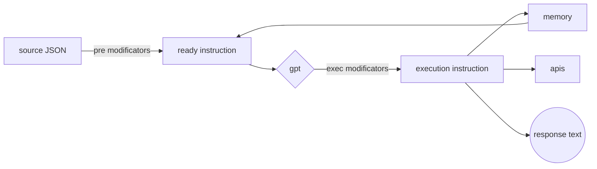

### Добро пожаловать в документации о написании исполняемых инструкций AI-M
## Общие положения


Исполняемая инструкция предстовляет из себя JSON где каждое поле будет описано ниже. Также  могут содержать модификаторы выполняемые в разные этапы жизненого цикла инструкции.

Каждая инструкция вызывает ряд исполняемых скриптов, которые могут выполнять полезную работу а так же изменять саму инструкцию, среди которых есть скрипт использующий gpt4, конечный вид инструкции содержит результирующий текст и параметры для конечных исполняемых скриптов, выполняющих полезную работу. 

#### JSON keys
```
   {
         "trigger": Keyword/unique name of the instruction,
         "welcome": text of the resulting message upon first request,
         "delay": number of seconds - minimum pause after a welcome message,
         "prompt": {
             "answer": basic guidance on what the resulting answers should be,
             "memory": basic guidance on what information is remembered,
             "apis": "json array of methods available for execution based on response results"
         },
         "recovery": {
             "wait": number of seconds from the first message when you need to come back and remind yourself,
             "text": reminder text
         },
     }
```
#### Life cycle and modificators


> pre modificators works only por "prompt"

##  Prompt
### answer
В этом поле описываются общие инструкции о том, что именно отвечать клиенту, оно также может быть изменено `pre modificators`, а также учитывайте, что в момент ее исполнения доступна информация о времени и `memory`

1. Определите конечную цель инструкции: перед тем, как начать писать инструкцию, определите, какую цель она должна достигнуть. Например, целью может быть описание шагов для выполнения определенной задачи или обучение сотрудников по использованию определенного программного обеспечения. 
2. Идентифицируйте ЦА ваших инструкций: вы должны знать, кто будет использовать ваши инструкции, чтобы соответствующим образом определить стиль и уровень детализации написания. Учтите уровень знаний и навыков ЦА при написании. 
3. Структурируйте текст инструкции: разделите инструкцию на понятные шаги или этапы, расположите их в логическом порядке. Используйте нумерацию или маркировку для облегчения восприятия. 
4.  Используйте простой и понятный язык: избегайте использования сложных терминов, специфической терминологии и длинных предложений. Пишите кратко, ясно и понятно. 
5.  **Ошибки** - обязательно опишите исчерпывающий порядок действий для нежелательных или непредвиденных ситуаций. 
6. Проверьте инструкцию на понимание: после написания инструкции, пройдите по ней самостоятельно, чтобы проверить, понятны ли вам все шаги и инструкции. Если что-то не понятно или необходимо внести изменения, исправьте соответствующим образом.

### memory
Это поле описывает что необходимо запомнить. Учитывайте, что запомненная информация доступна между сессиями, не сохроняйте туда конфеденциальную информацию.  Оно также может быть изменено `pre modificators`, а также учитывайте, что доступна информация о времени и предыдущем `memory`.

>Во избежании переполнения реализован механизм **забывания**, учитывайте это.
>Время забывания определяется автоматически, однако вы можете дополнить информацию об этом.

>Пожалуйста используйте `условия`, во избежании повторного запоминания фактов

>Учитывайте что общий обьем памяти составляет около 800 токенов, 
>переполнение памяти может привести к **фатальной ошибке**

*Если бы вы помнили каждое мгновение с момента вашего рождения вы бы сошли с ума, а после и вовсе ваша нервеная система дала бы сбой, поэтому **забывание** - критически важный механизм, относитесь к себе и к программам бережно*

### apis
В этом поле необходимо указать какие `http/https` медоды необходимо выполнить. Оно также может быть изменено `pre modificators`, а также учитывайте, что доступна информация о времени и `memory`

В качестве результата укажите массив JSON:
```
'[
	"http://localhost:8000/test?name=userName", 
	{
		"url":"http://localhost:8000/test?name=userName", 
		"method": "POST", 
		"headers": {"content-type": "application/json"}, 
		"body": {"phone": "userPhone" 
	} 
]'
```

## Modificators
### pre modificators
Модификаторы выполняющую полезную нагрузку и изменяющие инструкцию до обработки `gpt`

1. Модификаторы подстановки 
- **`[[metadata-key]]`**
-  **`[[/EcmaScript-Regex/]]`**

2. Модификаторы для вызова hhtp 
- **`<<GETjson<https://adress.com>>>`**
- **`<<GETtext<https://adress.com>>>`**
- **`<<GEThtml<https://adress.com>>>`**


>**Regex**  поиск совпадения в истории сообщений (может быть разное колличество в зависимости от клиента, например: telegramBot: до 7, plagin: сколько загруженно на странице и так далее)

>**metadata** обьект может содержать разные ключи в зависимости от клиентского приложения например:
```
	//telegramBot
	{
		clientName:  msg.from.username, 
		clientId:  msg.from.id, 
		webClient:  'telegram'
	}
	//plagin-instagram
	{
		clientName:  dialog-name, 
		clientId:  null, 
		webClient:  'instagram.com'
	}
```
### exec modificators
Модификаторы выполняющую полезную нагрузку после обработки `gpt`
 
 - **`{{key}}`**
 > Эти ключи не явлются частью строгого пространства имен, они должны отражать смысловую нагрузку о том что необходимо подставить вместо них

### Порядок выполнения модификаторов

> Модификаторы выполняются в порядке упоминания в этой интсрукции


## Exemples


